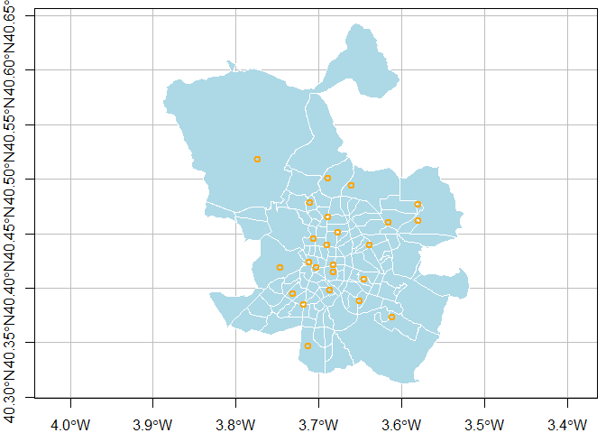
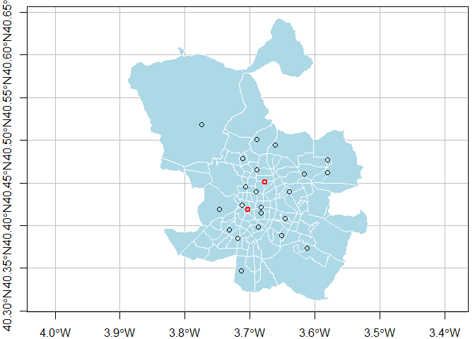
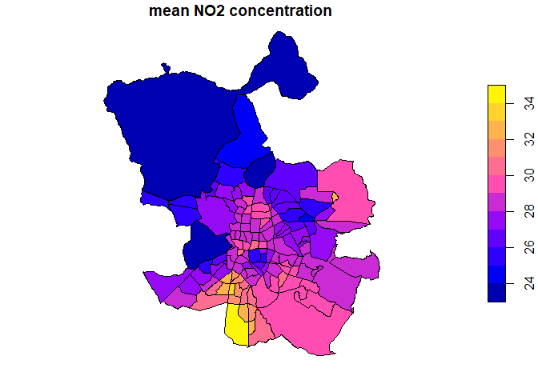
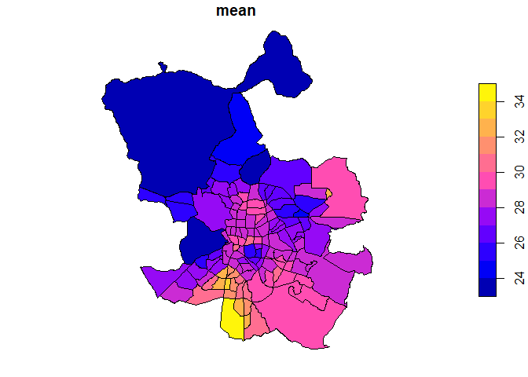
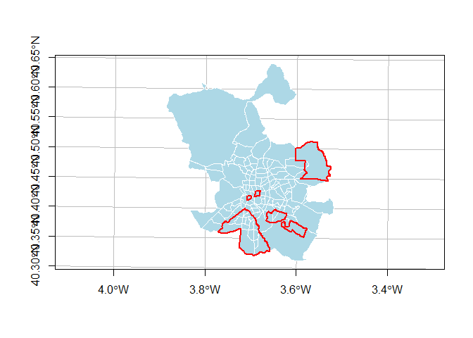
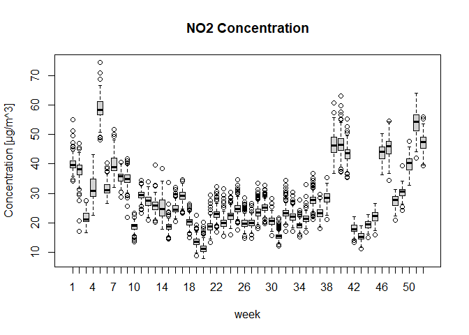
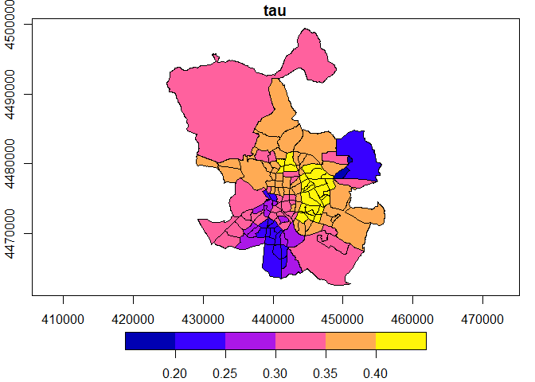

<!-- README.md is generated from README.Rmd. Please edit that file -->

``` r
library(widepollution)  # load custom package. Available at
  # https://github.com/rodrigomalagon/widepollution or via
  # install.packages("devtools")
  # devtools::install_github("rodrigomalagon/widepollution")
library(dplyr)  # used to arrange dataframe rows.
#> 
#> Attaching package: 'dplyr'
#> The following objects are masked from 'package:stats':
#> 
#>     filter, lag
#> The following objects are masked from 'package:base':
#> 
#>     intersect, setdiff, setequal, union
library(tidyr) # used to pivot a dataframe to create a summary table
library(sf)    # used for spatial analysis throughout the markdown
#> Linking to GEOS 3.11.2, GDAL 3.8.2, PROJ 9.3.1; sf_use_s2() is TRUE
library(units) # units of MB
#> udunits database from C:/Users/Propietario/AppData/Local/R/win-library/4.3/units/share/udunits/udunits2.xml
library(rjson) # read json in processing stage
library(stars) # used for data cube analysis
#> Loading required package: abind
library(gstat) # used for interpolation
library(zyp)   # used to perform time series analysis
#> Loading required package: Kendall
```

# Spatio-temporal monitoring of Madrid pollution in 2023 (Data processing)

Author: Rodrigo Malagón Rodríguez

This project aims to demonstrate some useful techniques of data
processing and analysis to derive trends at quarter level of
neighborhoods of a city out of individual sensor data spread throughout
the city. The most important tools used include interpolation, vectorial
datacube aggregation, and trend time series analysis.

# I. Introduction

Madrid suffers from high trends of pollution due to the strong use of
cars and narrow crowded streets. Road traffic can drive as much as 90%
of NO2 concentration in the centre of the city (Borge et al., 2014).
Similar is the case of PM2.5, mainly caused by heavy car use in the city
(Ortiz et al., 2017). Moreover, in previous years, $NO_2$ concentrations
in the city surpassed the annual limit of 40 $\mu g/ m^3$, set by the EU
(EEA, 2019).

Following this key facts, in this project we investigate which
neighborhoods are mainly affected by pollution and how does this figure
vary across time. To focus our work, we perform the analysis of $NO_2$
pollution. We perform spatial interpolation of pollution point data
across time periods, we create datacubes and perform analyses on this
useful structure.

Also, the current vignette showcases the employment of processing
functions from a package made by ourseleves (`widepollution`) to aid in
the construction of a useful pollution dataset of Madrid for the year
2023.

# II. Data processing

In this section we process our main datasets from [Madrid Open Data
portal](https://datos.madrid.es/portal/site/egob). The main pollution
datasets consis of **wide-format** monthly tables with hours on columns
and measuring stations by type of pollutant by day on rows.

## II.1 Madrid pollution data processing

We begin with a custom arrangement of our data files:

``` r
data_path <- "./rawdata/Year2023/"
file_paths <- list.files(data_path, full.names = TRUE, pattern = "*.csv")

#We extract a list of months ordered as the files are
file_names <- list.files(data_path, full.names = FALSE, pattern = "*.csv")
months <- lapply(file_names,function(str){
  month <- strsplit(str,'_',fixed=TRUE)[[1]][1]
}) |> unlist()

#Reordering  of files in a custom (chronological) order from the Spanish names
files <- data.frame(path=file_paths, month=months)
months_order <- c('ene','feb','mar','abr','may','jun','jul','ago','sep','oct','nov','dic')
files <- arrange(files,factor(files$month,levels = months_order))
```

We iterate data extraction and an unpivot process through all the
monthly files. Then we construct a single long-format dataframe. We
perform processing to ensure appropriate data types and set a useful
dataframe structure for further analyses.

``` r
monthly_data <- list()

# Extraction and unpivot
for (month in 1:12){
  month_path <- files$path[month]
  df <- read.csv(month_path,sep=';',fileEncoding = "UTF-8")
  monthly_data[[month]] <- parallel_unpivot(df,
                                            'H',
                                            'V',
                                            'measure',
                                            'validation',
                                            'hour',
                                            '(H|V)([[:digit:]]+)')
}
year_data <-  do.call('rbind',monthly_data) #binding all monthly data into one single dataframe

# Change data type of extracted hour column
year_data$hour <- as.integer(year_data$hour)

year_data$measure <- as.numeric(year_data$measure)

# Rename and extract columns of interest
year_data  <- rename_columns(year_data,
                           c('ESTACION','MES','DIA','MAGNITUD'),
                           c('station_id','month','day','pollutant_id'))
year_data <- year_data[c('station_id','pollutant_id','month','day','hour','validation','measure')]

# Convert V-F values to booleans for the validation column
year_data$validation <- lapply(year_data$validation, function(x){x=='V'})|>unlist()

# Save and show data
head(year_data)
#>   station_id pollutant_id month day hour validation measure
#> 1          4            1     1   1    1       TRUE       1
#> 2          4            1     1   1    2       TRUE       3
#> 3          4            1     1   1    3       TRUE       3
#> 4          4            1     1   1    4       TRUE       2
#> 5          4            1     1   1    5       TRUE       1
#> 6          4            1     1   1    6       TRUE       1
```

We incorporate pollutants metadata with descriptive information.

``` r
# Load data
pollutants <- "./rawdata/pollutants.csv" |> read.csv(sep=',',encoding = 'UTF-8')

# Rearrange data
pollutants <- rename_columns(pollutants,
                             c('Cod.','Abrevia.','Unidad'),
                             c('pollutant_id','pollutant_name','unit')
                             )
pollutants <- pollutants[c('pollutant_id','pollutant_name','unit')]
pollutants$unit <- gsub('m3','m^3',pollutants$unit) 
pollutants$unit|>enc2utf8()-> pollutants$unit #Ensuring utf-8

# Data merge (join)
year_data <- merge(year_data,pollutants,by='pollutant_id')

# Save and show
save(year_data,file = './processed_data/year_data.rda')
save(pollutants,file = './processed_data/pollutants.rda')
year_data |> head()
#>   pollutant_id station_id month day hour validation measure pollutant_name
#> 1            1          4     1   1    1       TRUE       1            SO2
#> 2            1          4     1   1    2       TRUE       3            SO2
#> 3            1          4     1   1    3       TRUE       3            SO2
#> 4            1          4     1   1    4       TRUE       2            SO2
#> 5            1          4     1   1    5       TRUE       1            SO2
#> 6            1          4     1   1    6       TRUE       1            SO2
#>     unit
#> 1 µg/m^3
#> 2 µg/m^3
#> 3 µg/m^3
#> 4 µg/m^3
#> 5 µg/m^3
#> 6 µg/m^3
```

### Dataset inspection

We can now get a glance of the proportion of “verified” samples from the
dataset, following the metadata description available on the portal:

``` r
verified <- sum(year_data$validation)
total <- dim(year_data)[1]
paste0(round(verified/total * 100,2),' %')
#> [1] "97.95 %"
```

We verify that no `NULL` values are provided in the dataset:

``` r
paste0('Number of NULL measures found: ',
       sum(unlist(lapply(year_data$measure,is.null))))
#> [1] "Number of NULL measures found: 0"
```

We now inspect the proportion of data by type of pollutant and compare
it with the desired number of data measurements, namely
`number of stations`$\times\ 365$ `days of the year` $\times\ 24$
`hours of the day`.

``` r
pollutant_summary <- aggregate(measure~pollutant_name,data= year_data,length)|>
  rename_columns('measure','num_of_measures')
pollutant_summary <- pollutant_summary[order(pollutant_summary$num_of_measures,decreasing=TRUE),]


desired_num_measurements <- length(unique(year_data$station_id)) * 365 * 24
pollutant_summary$percentage_of_completeness <- pollutant_summary$num_of_measures*100 /desired_num_measurements

pollutant_summary|>print()
#>    pollutant_name num_of_measures percentage_of_completeness
#> 4              NO          207096                   98.50457
#> 5             NO2          207096                   98.50457
#> 6             NOx          207096                   98.50457
#> 8            PM10          113232                   53.85845
#> 7              O3          112200                   53.36758
#> 9           PM2.5           69528                   33.07078
#> 1             BEN           50208                   23.88128
#> 3             EBE           50208                   23.88128
#> 11            TOL           50208                   23.88128
#> 2              CO           33480                   15.92466
#> 10            SO2           33456                   15.91324
```

Though no `NULL` values were found in the dataset, it seems that **most
pollutants lack data** through time and across the sensor network. This
is why the interpolation methods are leveraged to **account for missing
data** around a particular sensor in a given time.

For simplicity and leveraging the most complete dataset, we will do our
analysis with the $NO_2$. We thus inspect in more detail data from this
pollutant. We should have, by station-month combination, a total of
measurements equal to the `number of days of that month` $\times\ 24$
`hours of the day`. We know, by the wide structure of our initial
dataset, that missing hours will not be the case, so we perform the
inspection at the “day level” (division by $24$):

``` r
#Extract NO2 pollution data
no2_madrid <- year_data[year_data$pollutant_name=='NO2',]
#Extracting day of the year
no2_madrid$date <- as.Date(paste0('2023-',no2_madrid$month,'-',no2_madrid$day))
#Week of the year extraction
no2_madrid$week_num <- no2_madrid$date|>lubridate::isoweek()
```

``` r

#Compute a list of desired values per month (i.e. january = 31, february = 28, etc.)
desired_vals <- difftime(
  as.Date(paste0('2023-',1:12,'-01')),
c(as.Date(paste0('2023-',2:12,'-01')),as.Date('2024-01-01'))) |> abs() |> as.numeric() 

#Retrieve a wide-format summary of the number of monthly missing measurements per station
aggregate(measure~month+station_id,no2_madrid,function(x){length(x)/24})|>
  pivot_wider(
    names_from = station_id,
    names_glue = "station_{station_id}",
    values_from = measure,
    values_fill = 0) -> no2_count_summary

for (cols in  2:length(no2_count_summary)){
no2_count_summary[cols] <- lapply(no2_count_summary[cols],function(x){x-desired_vals})  
}

no2_count_summary
#> # A tibble: 12 × 25
#>    month station_4 station_8 station_11 station_16 station_17 station_18
#>    <int>     <dbl>     <dbl>      <dbl>      <dbl>      <dbl>      <dbl>
#>  1     1         0         0        -22          0          0          0
#>  2     2         0         0        -28          0          0          0
#>  3     3         0         0         -6          0          0          0
#>  4     4         0         0          0          0          0          0
#>  5     5         0         0          0          0          0          0
#>  6     6         0         0          0          0          0          0
#>  7     7         0         0          0          0          0          0
#>  8     8         0         0          0          0          0          0
#>  9     9         0         0          0          0          0          0
#> 10    10         0         0          0          0          0          0
#> 11    11         0         0          0          0          0          0
#> 12    12         0         0          0          0          0          0
#> # ℹ 18 more variables: station_24 <dbl>, station_27 <dbl>, station_35 <dbl>,
#> #   station_36 <dbl>, station_38 <dbl>, station_39 <dbl>, station_40 <dbl>,
#> #   station_47 <dbl>, station_48 <dbl>, station_49 <dbl>, station_50 <dbl>,
#> #   station_54 <dbl>, station_55 <dbl>, station_56 <dbl>, station_57 <dbl>,
#> #   station_58 <dbl>, station_59 <dbl>, station_60 <dbl>
```

Inspecting this summary dataframe, we conclude that most stations
possess complete $NO_2$ records per month and, most important, missing
dates spatially concentrate in few stations. Therefore, we can get proxy
readings for those locations by interpolation later on. We continue our
workflow focusing on this pollutant.

## II.2 Integration of stations locations

We now load the stations data and locations (point geometries), defining
the column `station_id` to perform the dataframes join when needed.

``` r
#Read stations csv

stations <- './rawdata/stations.csv'|> read.csv(,sep=';',fileEncoding = "UTF-8")

#Translate and align column names
stations <- rename_columns(stations,c('CODIGO_CORTO','ESTACION','LONGITUD','LATITUD'),c('station_id','station_name','long','lat'))
stations <- stations[c('station_id','station_name','long','lat')]

#Ensuring ASCII characters for names (key step to avoid warnings/notes on package)
#stations$station_name|>iconv(,to='ASCII//TRANSLIT') -> stations$station_name

#Set georeference
stations_crs <- st_crs("WGS84" )
stations <- st_as_sf(stations,coords=c('long','lat'),crs=stations_crs)
save(stations,file = './processed_data/stations.rda')
save(stations_crs,file='./processed_data/stations_crs.rda')
stations
#> Simple feature collection with 24 features and 2 fields
#> Geometry type: POINT
#> Dimension:     XY
#> Bounding box:  xmin: -3.77461 ymin: 40.34715 xmax: -3.580026 ymax: 40.51807
#> Geodetic CRS:  WGS 84
#> First 10 features:
#>    station_id     station_name                   geometry
#> 1           4  Plaza de España POINT (-3.712257 40.42388)
#> 2           8 Escuelas Aguirre POINT (-3.682316 40.42155)
#> 3          11    Ramón y Cajal POINT (-3.677349 40.45147)
#> 4          16     Arturo Soria POINT (-3.639242 40.44005)
#> 5          17       Villaverde POINT (-3.713317 40.34715)
#> 6          18        Farolillo POINT (-3.731836 40.39478)
#> 7          24    Casa de Campo POINT (-3.747345 40.41936)
#> 8          27   Barajas Pueblo POINT (-3.580026 40.47692)
#> 9          35 Plaza del Carmen POINT (-3.703166 40.41921)
#> 10         36        Moratalaz  POINT (-3.64531 40.40795)
```

We then join the dataframes and inspect the size of the dataset (in
MBs).

``` r
#Data join
no2_madrid <- merge(no2_madrid,stations,by='station_id')|>
  st_sf(crs = stations_crs)

save(no2_madrid,file='./processed_data/no2_madrid.rda')

#Inspection of NOx dataset size (with geometries)
(object.size(no2_madrid)/10e6) |> 
  as.numeric()|>
  set_units(,value=MB)
#> 10.43856 [MB]
```

## II.3 Neighborhoods data processing

To exhibit the handling of another data type (JSON file) the following
steps integrate the Madrid neighborhoods to our workflow to provide more
spatial context and extract valuable insights per neighborhood. The
original dataset provides the neighborhoods’ border linestring
coordinates given in the `ETRS89` CRS, which has `meters` as units. This
will be suitable in the furthcoming analyses. However, for consistency
with the pollution dataset, now we reproject to `WGS84`.

``` r
#Extraction of data from json file
file_path <- './rawdata/neighborhoods.json'
read <- paste(readLines(file_path, warn=FALSE),collapse = "")
neighborhoods_json <- fromJSON(read)
neighborhoods_crs <- st_crs(neighborhoods_json$crs$properties$name)
save(neighborhoods_crs,file = './processed_data/neighborhoods_crs.rda')

# Extraction of sf linestring objects from json using helping function
num_neighborhoods <- length(neighborhoods_json$features)
neighborhoods <- data.frame(FID = 1:num_neighborhoods)
neighborhoods$geometry <- lapply(neighborhoods$FID,function(x){extract_linestring_from_json_list(x,neighborhoods_json)})

# Final construction of sf collection
neighborhoods <- st_as_sf(neighborhoods,crs = neighborhoods_crs)|>
  st_polygonize()|>
  st_transform(,crs=stations_crs)

# Incorporation of metadata and selection of meaningful columns
neigh_metadata <- "./rawdata/neighborhoods_metadata.csv" |> read.csv(sep=',',encoding = 'UTF-8')
#neigh_metadata$NOMBRE|>iconv(,to='ASCII//TRANSLIT') -> neigh_metadata$NOMBRE #Ensuring ASCII characters


neighborhoods <- merge(neighborhoods,neigh_metadata,by = 'FID')
neighborhoods <- rename_columns(neighborhoods,c('NOMBRE','NOMDIS'),c('name','district'))
neighborhoods <- neighborhoods[c('FID','name','district')]

# Save and show
save(neighborhoods,file = './processed_data/neighborhoods.rda')
neighborhoods
#> Simple feature collection with 131 features and 3 fields
#> Geometry type: GEOMETRYCOLLECTION
#> Dimension:     XY
#> Bounding box:  xmin: -3.888963 ymin: 40.31206 xmax: -3.518126 ymax: 40.64328
#> Geodetic CRS:  WGS 84
#> First 10 features:
#>    FID        name   district                       geometry
#> 1    1 Embajadores     Centro GEOMETRYCOLLECTION (POLYGON...
#> 2    2      Cortes     Centro GEOMETRYCOLLECTION (POLYGON...
#> 3    3         Sol     Centro GEOMETRYCOLLECTION (POLYGON...
#> 4    4     Palacio     Centro GEOMETRYCOLLECTION (POLYGON...
#> 5    5    Justicia     Centro GEOMETRYCOLLECTION (POLYGON...
#> 6    6 Universidad     Centro GEOMETRYCOLLECTION (POLYGON...
#> 7    7     Legazpi Arganzuela GEOMETRYCOLLECTION (POLYGON...
#> 8    8     Chopera Arganzuela GEOMETRYCOLLECTION (POLYGON...
#> 9    9    Delicias Arganzuela GEOMETRYCOLLECTION (POLYGON...
#> 10  10     Acacias Arganzuela GEOMETRYCOLLECTION (POLYGON...
```

First rendering of a plot for contextual and consistency verification:

``` r
#Plot of pollution stations and neighborhoods
par(mar = c(2,2,0.5,0.5), mgp = c(0, 1, 0))
plot(neighborhoods$geometry,graticule=TRUE,col_graticule='gray',lwd = 0.1,col='lightblue',axes=TRUE,border=0)
plot(stations$geometry,lwd=2,col='orange',add=TRUE)
```

<!-- -->

Moreover, we make sure that the most persistently missing data (in
stations with `station_id` 11 and 35, shown in the `Dataset inspection`
section) is enclosed by nearby sensors:

``` r
par(mar = c(2,2,0.5,0.5), mgp = c(0, 1, 0))
plot(neighborhoods$geometry,graticule=TRUE,col_graticule='gray',lwd = 0.1,col='lightblue',axes=TRUE,border=0)
plot(stations$geometry,add=TRUE)
plot(stations$geometry[stations$station_id%in%c(11,35)],col='red',add=TRUE,lwd = 2)
```

<!-- -->

# III. Analysis

In this section we perform the data analysis of the previously
retrieved, transformed and constructed datasets.

``` r
#load data
path <- './processed_data/'

load(paste0(path,'stations.rda'))
load(paste0(path,'stations_crs.rda'))

load(paste0(path,'neighborhoods.rda'))
load(paste0(path,'neighborhoods_crs.rda'))

load(paste0(path,'no2_madrid.rda'))
```

## III.1 Annual analysis

We execute data aggregation at the year level and perform interpolation
through `Inverse Distsance Interpolation`.

``` r

#Station data aggregation with mean values
no2_mad_year <- aggregate(measure~station_id,no2_madrid,mean)|>
  merge(stations,by='station_id')|>
  st_sf(crs=stations_crs)|>
  st_transform(crs=neighborhoods_crs) #transforming to ETRS89 / UTM30 to gain support for meters as unit

#Obtain the whole Madrid area to clip grid
neighborhoods$geometry |>
  st_union() |> st_transform(crs=neighborhoods_crs) -> madrid

grid <- madrid |> st_bbox() |>
  st_as_stars(dx=100) |> #set spatial resolution
  st_crop(madrid) 

#Perform interpolation and construct a stars data cube


inter <- idw(measure~1, no2_mad_year, grid)
#> [inverse distance weighted interpolation]
names(inter)[[1]]<- 'mean NO2 concentration' #naming of var
no2_mad_year_raster <- inter [1,,]
(no2_mad_year_raster)
#> stars object with 2 dimensions and 1 attribute
#> attribute(s):
#>                             Min. 1st Qu.   Median    Mean  3rd Qu.     Max.
#> mean NO2 concentration  13.23758 24.5605 26.89419 26.5692 28.90803 36.53478
#>                          NA's
#> mean NO2 concentration  54756
#> dimension(s):
#>   from  to  offset delta                refsys x/y
#> x    1 313  424754   100 ETRS89 / UTM zone 30N [x]
#> y    1 368 4499365  -100 ETRS89 / UTM zone 30N [y]
```

### Neighborhoods analysis

We now take advantage of the `stars` object created to perform an
analysis per neighborhood that can be useful for the authorities, in
order to identify risk at that level. Explicitly, we compute the mean
concentration of $NO_2$ per neighborhood throughout the year.

``` r
# Aggregate annual values by neighborhood
aggregator <- st_transform(neighborhoods$geometry,crs=neighborhoods_crs)
no2_mad_year_stars <- aggregate(no2_mad_year_raster,by = aggregator,mean)

# Show
plot(no2_mad_year_stars,breaks='pretty')
```

<!-- -->

We reshape our year analysed data into a dataframe:

``` r
# Retrieving names of neighborhoods
no2_mad_year <- no2_mad_year_stars |> as.data.frame() |> st_sf(crs=neighborhoods_crs)


no2_mad_year$FID <- 1:131
no2_mad_year <- merge(no2_mad_year,
      st_drop_geometry(neighborhoods[c('FID','name')]),
      by='FID')
colnames(no2_mad_year)[2]<-'mean'


#Export to shapefile
#no2_mad_year |> sf::st_collection_extract(type="POLYGON")|>
 # st_write('./exported_data/shapefiles/madrid_mean_year_by_neighborhood.shp')

# Save and show
save(no2_mad_year, file = 'processed_data/no2_mad_year.rda')
plot(no2_mad_year['mean'])
```

<!-- -->

We could recover the neighborhoods names by the id, as the aggregation
step was done following the order of the `neighborhoods` sf object.
Then, we can obtain the 10 most polluted neighborhoods by name and plot
them as well:

``` r
n<-25
most_polluted <- no2_mad_year[order(no2_mad_year$mean,decreasing = TRUE),][1:n,c('name','mean')]
(most_polluted$name)
#>  [1] "San Cristóbal"                                  
#>  [2] "Almendrales"                                    
#>  [3] "Villaverde Alto - Casco Histórico de Villaverde"
#>  [4] "San Isidro"                                     
#>  [5] "Casco Histórico de Barajas"                     
#>  [6] "Abrantes"                                       
#>  [7] "Butarque"                                       
#>  [8] "Moscardó"                                       
#>  [9] "Orcasitas"                                      
#> [10] "Pradolongo"                                     
#> [11] "Los Rosales"                                    
#> [12] "Buenavista"                                     
#> [13] "Ángeles"                                        
#> [14] "San Fermín"                                     
#> [15] "Universidad"                                    
#> [16] "Zofío"                                          
#> [17] "Comillas"                                       
#> [18] "Goya"                                           
#> [19] "Orcasur"                                        
#> [20] "Opañel"                                         
#> [21] "Portazgo"                                       
#> [22] "Palomeras Bajas"                                
#> [23] "Corralejos"                                     
#> [24] "San Diego"                                      
#> [25] "Santa Eugenia"


#most_polluted |> st_union() |> st_buffer(1) -> export
#Write shapefile
#file_name <- paste0('./exported_data/shapefiles/',n,'_most_polluted.shp')
#st_write(export,file_name)
```

``` r
#Plot the most polluted neighborhoods with greater mean concentration of NOx through 2023
neighborhoods$geometry|>st_transform(crs=neighborhoods_crs)|>
  plot(border=0,col='lightblue',graticule=TRUE,axes=TRUE)
most_polluted$geometry |> st_union() |> st_buffer(1) |>#mini buffer to clean unprecise union
  plot(lwd = 2,border ='red', alpha = 0,add=TRUE)
```

<!-- -->

## III.2 Weeklky analysis

### Weekly data cube creation

We execute data aggregation at the week level and perform interpolation
through `Inverse Distsance Interpolation` per week

``` r
#week-station data aggregation with mean values
no2_mad_week <- aggregate(measure~week_num+station_id,no2_madrid,mean)|>
  merge(stations,by='station_id')|>
  st_sf(crs=stations_crs)|>
  st_transform(crs=neighborhoods_crs) #transforming to ETRS89 / UTM30 to gain support for meters as unit
```

``` r
#Obtain the whole Madrid area to clip grid
neighborhoods$geometry |>
  st_union() |> st_transform(crs=neighborhoods_crs) -> madrid

grid <- madrid |> st_bbox() |>
  st_as_stars(dx=100) |> #100m resolution to ease calculations
  st_crop(madrid)
grid
#> stars object with 2 dimensions and 1 attribute
#> attribute(s):
#>         Min. 1st Qu. Median Mean 3rd Qu. Max.  NA's
#> values     0       0      0    0       0    0 54756
#> dimension(s):
#>   from  to  offset delta                refsys x/y
#> x    1 313  424754   100 ETRS89 / UTM zone 30N [x]
#> y    1 368 4499365  -100 ETRS89 / UTM zone 30N [y]
```

``` r
#Perform interpolation per month and construct a stars data cube


l <- list()

for (week in 1:52){
  week_data <- no2_mad_week[no2_mad_week$week_num ==week,]
  inter <- idw(measure~1, week_data, grid)
  names(inter)[[1]] <- week
  l[[week]] <- inter [1,,]
}
#> [inverse distance weighted interpolation]
#> [inverse distance weighted interpolation]
#> [inverse distance weighted interpolation]
#> [inverse distance weighted interpolation]
#> [inverse distance weighted interpolation]
#> [inverse distance weighted interpolation]
#> [inverse distance weighted interpolation]
#> [inverse distance weighted interpolation]
#> [inverse distance weighted interpolation]
#> [inverse distance weighted interpolation]
#> [inverse distance weighted interpolation]
#> [inverse distance weighted interpolation]
#> [inverse distance weighted interpolation]
#> [inverse distance weighted interpolation]
#> [inverse distance weighted interpolation]
#> [inverse distance weighted interpolation]
#> [inverse distance weighted interpolation]
#> [inverse distance weighted interpolation]
#> [inverse distance weighted interpolation]
#> [inverse distance weighted interpolation]
#> [inverse distance weighted interpolation]
#> [inverse distance weighted interpolation]
#> [inverse distance weighted interpolation]
#> [inverse distance weighted interpolation]
#> [inverse distance weighted interpolation]
#> [inverse distance weighted interpolation]
#> [inverse distance weighted interpolation]
#> [inverse distance weighted interpolation]
#> [inverse distance weighted interpolation]
#> [inverse distance weighted interpolation]
#> [inverse distance weighted interpolation]
#> [inverse distance weighted interpolation]
#> [inverse distance weighted interpolation]
#> [inverse distance weighted interpolation]
#> [inverse distance weighted interpolation]
#> [inverse distance weighted interpolation]
#> [inverse distance weighted interpolation]
#> [inverse distance weighted interpolation]
#> [inverse distance weighted interpolation]
#> [inverse distance weighted interpolation]
#> [inverse distance weighted interpolation]
#> [inverse distance weighted interpolation]
#> [inverse distance weighted interpolation]
#> [inverse distance weighted interpolation]
#> [inverse distance weighted interpolation]
#> [inverse distance weighted interpolation]
#> [inverse distance weighted interpolation]
#> [inverse distance weighted interpolation]
#> [inverse distance weighted interpolation]
#> [inverse distance weighted interpolation]
#> [inverse distance weighted interpolation]
#> [inverse distance weighted interpolation]


no2_mad_week_cube <- do.call(c,l)|>merge(name = "week") |> setNames("NO2 concentration")
no2_mad_week_cube
#> stars object with 3 dimensions and 1 attribute
#> attribute(s), summary of first 1e+05 cells:
#>                        Min.  1st Qu.   Median     Mean  3rd Qu.     Max.  NA's
#> NO2 concentration  19.65989 35.91142 38.51343 37.87285 40.47321 57.21872 44444
#> dimension(s):
#>      from  to  offset delta                refsys   values x/y
#> x       1 313  424754   100 ETRS89 / UTM zone 30N     NULL [x]
#> y       1 368 4499365  -100 ETRS89 / UTM zone 30N     NULL [y]
#> week    1  52      NA    NA                    NA 1,...,52
save(no2_mad_week_cube,file='./processed_data/no2_mad_week_cube.rda')
```

Neighborhood aggregation

``` r
aggregator <- st_transform(neighborhoods$geometry,crs=neighborhoods_crs)
no2_neigh_week <- aggregate(no2_mad_week_cube,aggregator,mean)
names(no2_neigh_week) <- 'mean NO2 concentration'

# Save and show
save(no2_neigh_week,file='./processed_data/no2_neigh_week.rda')
no2_neigh_week
#> stars object with 2 dimensions and 1 attribute
#> attribute(s):
#>                             Min.  1st Qu.   Median     Mean  3rd Qu.     Max.
#> mean NO2 concentration  7.721005 20.22948 25.11118 28.41098 35.40621 74.41236
#> dimension(s):
#>          from  to                refsys point
#> geometry    1 131 ETRS89 / UTM zone 30N FALSE
#> week        1  52                    NA    NA
#>                                                                 values
#> geometry GEOMETRYCOLLECTION (POLYG...,...,GEOMETRYCOLLECTION (POLYG...
#> week                                                          1,...,52
```

### Mann-Kendall analysis

``` r
#Load previous data
load('./processed_data/no2_neigh_week.rda')
no2_neigh_week
#> stars object with 2 dimensions and 1 attribute
#> attribute(s):
#>                             Min.  1st Qu.   Median     Mean  3rd Qu.     Max.
#> mean NO2 concentration  7.721005 20.22948 25.11118 28.41098 35.40621 74.41236
#> dimension(s):
#>          from  to                refsys point
#> geometry    1 131 ETRS89 / UTM zone 30N FALSE
#> week        1  52                    NA    NA
#>                                                                 values
#> geometry GEOMETRYCOLLECTION (POLYG...,...,GEOMETRYCOLLECTION (POLYG...
#> week                                                          1,...,52
```

Helping functions

``` r
#Extracta Mann-Kendall statistics from cube
ext_mannkendall <- function(x,outcome='tau'){
  m <- Kendall::MannKendall(x)
  as.numeric(m[outcome][1])
}

#Apply test to data cube on period
apply_mk <- function(cube,period){
  subset_cube <- cube[,,period]
  
  stars::st_apply(subset_cube,MARGIN=c('geometry'),FUN=function(x){
  ext_mannkendall(x,outcome = 'tau')
  }) |> sf::st_as_sf() -> df_tau
  
  stars::st_apply(subset_cube,MARGIN=c('geometry'),FUN=function(x){
  ext_mannkendall(x,outcome = 'sl')
  }) |> sf::st_as_sf()-> df_pval
  
  #Rearrange data frame and add geometry
  sf<- data.frame(tau = df_tau[[1]], two_sided_pval = df_pval[[1]],geometry = df_tau$geometry)|> sf::st_as_sf(crs=neighborhoods_crs)
  
  return(sf)
}
```

Plot general evolution of NO2

``` r
df <- data.frame(no2_neigh_week)
#df <- aggregate(mean.NO2.concentration~week,df,mean)
#jpg(filename="./exported_data/plot.jpg")
plot(df$week,df$mean.NO2.concentration,main = 'NO2 Concentration',xlab = 'week',ylab='Concentration [μg/m^3]')
```

<!-- -->

``` r
#dev.off()
```

Apply test on periods (quarters) and add neighborhood names

``` r
q_results <- list()
q <- list(q1=1:26,q2=14:26,q3=27:39,q4=40:52)

for (i in 1:4){
  q_results[[i]] <-apply_mk(no2_neigh_week,q[[i]])
  q_results[[i]]$name <- neighborhoods$name
}

# Show an example of the quarters' results
q_results[[2]]
#> Simple feature collection with 131 features and 3 fields
#> Geometry type: GEOMETRYCOLLECTION
#> Dimension:     XY
#> Bounding box:  xmin: 424753.5 ymin: 4462566 xmax: 456033.3 ymax: 4499365
#> Projected CRS: ETRS89 / UTM zone 30N
#> First 10 features:
#>            tau two_sided_pval                       geometry        name
#> 1  -0.23076925     0.29966539 GEOMETRYCOLLECTION (POLYGON... Embajadores
#> 2  -0.28205130     0.20012809 GEOMETRYCOLLECTION (POLYGON...      Cortes
#> 3  -0.30769235     0.16055588 GEOMETRYCOLLECTION (POLYGON...         Sol
#> 4  -0.30769235     0.16055588 GEOMETRYCOLLECTION (POLYGON...     Palacio
#> 5  -0.28205130     0.20012809 GEOMETRYCOLLECTION (POLYGON...    Justicia
#> 6  -0.43589747     0.04408378 GEOMETRYCOLLECTION (POLYGON... Universidad
#> 7  -0.10256411     0.66933405 GEOMETRYCOLLECTION (POLYGON...     Legazpi
#> 8  -0.10256411     0.66933405 GEOMETRYCOLLECTION (POLYGON...     Chopera
#> 9  -0.07692309     0.76033229 GEOMETRYCOLLECTION (POLYGON...    Delicias
#> 10 -0.10256411     0.66933405 GEOMETRYCOLLECTION (POLYGON...     Acacias
```

Ploting for inspection

``` r
quarter <- 4

par(mfrow = c(1,2))
plot(q_results[[quarter]][c('tau','geometry')],main = 'tau',axes=TRUE)

plot(q_results[[quarter]][c('two_sided_pval','geometry')],main = 'two-sided pval',axes=TRUE,breaks = c(0,0.01,0.03,0.05,0.075,0.1),add=TRUE) 
```

<!-- -->

Reclassification according to p values

``` r

reclass_tau <- function(tau){
  if(tau>0){
    return('positive trend')
  }
  else if(tau == 0){
    return('cero trend')
  }
  return('negative trend')
}

reclass <- function(tau,pval){
  if(pval>0.1){
    return('No statistically significant trend')
  }
  else if(pval > 0.05){
    m <- paste0(reclass_tau(tau),' with prob > 90%')
    return(m)
  }
  else if(pval > 0.03){
    m <- paste0(reclass_tau(tau),' with prob > 95%')
    return(m)
  }
  else if(pval > 0.01){
    m <- paste0(reclass_tau(tau),' with prob > 97%')
    return(m)
  }
  m <- paste0(reclass_tau(tau),' with prob > 99%')
  return(m)
}
```

Applying trend classification and creating shapefiles

``` r
for (quarter in 1:4){
  df <- q_results[[quarter]]
  df$classification <- rep(NA,nrow(df))
  for(row in 1:nrow(df)){
    df[row,]$classification <- reclass(df[row,]$tau,df[row,]$two_sided_pval)
  }
  q_results[[quarter]] <- df
}

q_results[[1]]
#> Simple feature collection with 131 features and 4 fields
#> Geometry type: GEOMETRYCOLLECTION
#> Dimension:     XY
#> Bounding box:  xmin: 424753.5 ymin: 4462566 xmax: 456033.3 ymax: 4499365
#> Projected CRS: ETRS89 / UTM zone 30N
#> First 10 features:
#>           tau two_sided_pval                       geometry        name
#> 1  -0.5076923   0.0003005630 GEOMETRYCOLLECTION (POLYGON... Embajadores
#> 2  -0.5261539   0.0001789167 GEOMETRYCOLLECTION (POLYGON...      Cortes
#> 3  -0.5446154   0.0001047519 GEOMETRYCOLLECTION (POLYGON...         Sol
#> 4  -0.5446154   0.0001047519 GEOMETRYCOLLECTION (POLYGON...     Palacio
#> 5  -0.5138462   0.0002533027 GEOMETRYCOLLECTION (POLYGON...    Justicia
#> 6  -0.5200000   0.0002130812 GEOMETRYCOLLECTION (POLYGON... Universidad
#> 7  -0.4953847   0.0004208559 GEOMETRYCOLLECTION (POLYGON...     Legazpi
#> 8  -0.5015385   0.0003559861 GEOMETRYCOLLECTION (POLYGON...     Chopera
#> 9  -0.5200000   0.0002130812 GEOMETRYCOLLECTION (POLYGON...    Delicias
#> 10 -0.5446154   0.0001047519 GEOMETRYCOLLECTION (POLYGON...     Acacias
#>                    classification
#> 1  negative trend with prob > 99%
#> 2  negative trend with prob > 99%
#> 3  negative trend with prob > 99%
#> 4  negative trend with prob > 99%
#> 5  negative trend with prob > 99%
#> 6  negative trend with prob > 99%
#> 7  negative trend with prob > 99%
#> 8  negative trend with prob > 99%
#> 9  negative trend with prob > 99%
#> 10 negative trend with prob > 99%


for (quarter in 1:4){
  q_results[[quarter]] <-  q_results[[quarter]] |> sf::st_collection_extract(type="POLYGON") 
}


#for (quarter in 1:4){
  #writing shps
 # file_name <- paste0("exported_data/shapefiles/trend_classification_q_",quarter,".shp")
  #sf::st_write(q_results[[quarter]],file_name)
#}
```

# References

Borge, R., Lumbreras, J., Pérez, J., de la Paz, D., Vedrenne, M., de
Andrés, J. M., & Rodríguez, M. E. (2014). Emission inventories and
modeling requirements for the development of air quality plans.
Application to Madrid (Spain). The Science of the total environment,
466-467, 809–819. <https://doi.org/10.1016/j.scitotenv.2013.07.093>

European Environment Agency. (2019). “Air quality in Europe—2019
report”. EEA Report No 10/2019.Retrieved on June 24 at
<https://www.eea.europa.eu/publications/air-quality-in-europe-2019>

Ortiz, C., Linares, C., Carmona, R., & Díaz, J. (2017). Evaluation of
short-term mortality attributable to particulate matter pollution in
Spain. Environmental pollution (Barking, Essex : 1987), 224, 541–551.
<https://doi.org/10.1016/j.envpol.2017.02.037>
