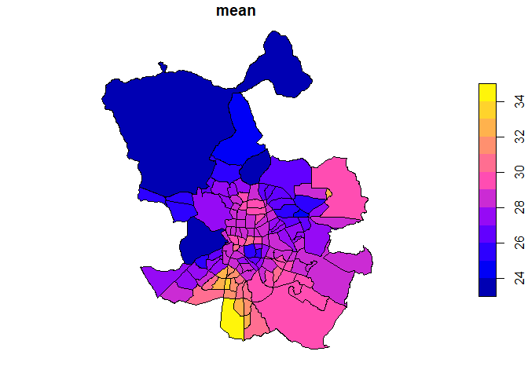

<!-- README.md is generated from README.Rmd. Please edit that file -->

# Madrid pollution 2023

Spatio-temporal analysis of Madrid's 2023 air-quality data, with a focus on annual and weekly NO2 patterns at neighborhood level. The project cleans wide-format station data, interpolates missing readings, aggregates results into raster and vector products, and classifies neighborhood trends over time.

## Main features

- Data ingestion and reshaping from monthly CSV files.
- Station and neighborhood geospatial integration with `sf`.
- IDW interpolation and `stars`-based data cubes.
- Annual mean NO2 mapping by neighborhood.
- Weekly evolution and Mann-Kendall trend classification.
- Export of outputs to shapefile and GeoJSON.

The dataset comes from the [Madrid Open Data portal](https://datos.madrid.es/portal/site/egob). The full processing workflow is documented in [Processing and Analysis.Rmd](Processing%20and%20Analysis.Rmd), with the rendered version available in [Processing-and-Analysis.md](Processing-and-Analysis.md). Helper functions live in [functions.R](functions.R).

## Key result

The annual mean NO2 concentration by neighborhood is exported as both GeoJSON and shapefile. The GeoJSON output is available at [exported_data/geojson/madrid_mean_year_by_neighborhood.geojson](exported_data/geojson/madrid_mean_year_by_neighborhood.geojson), and the matching shapefile is in [exported_data/shapefiles/madrid_mean_year_by_neighborhood.shp](exported_data/shapefiles/madrid_mean_year_by_neighborhood.shp).

